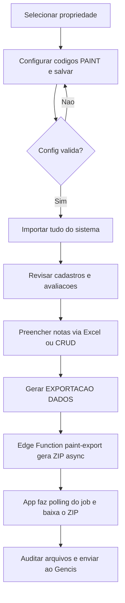
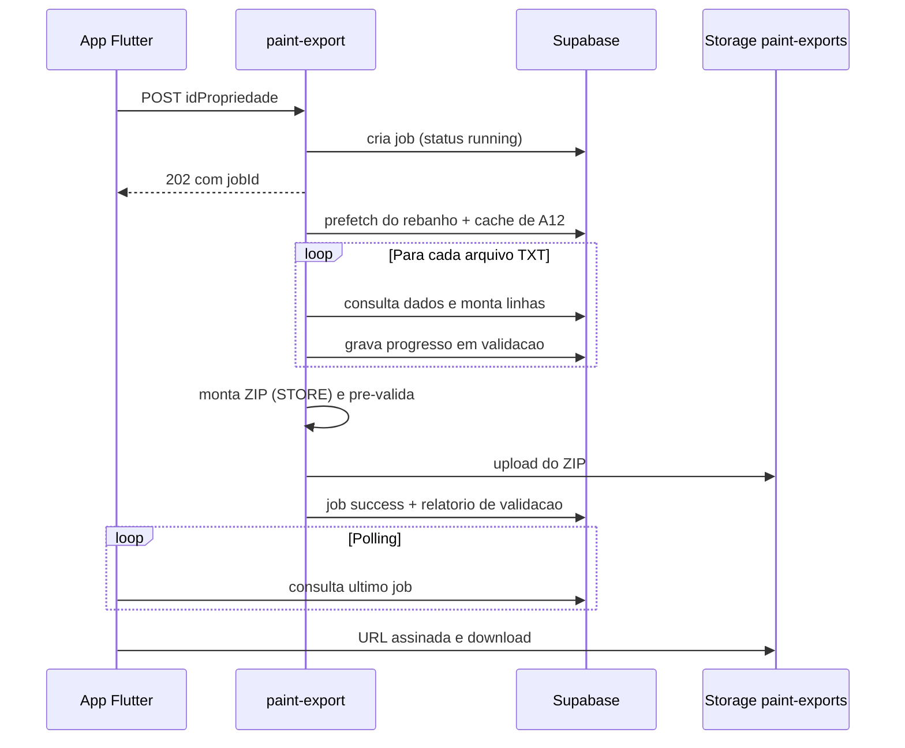

# Manual PAINT INLIDA

Manual completo e atualizado do módulo PAINT da INLIDA. Cobre desde a
configuração da fazenda até a geração e auditoria do arquivo final de
exportação, já incorporando todas as melhorias da rodada de homologação de
Jun/2026 (calls com o time PAINT em 01/06 e 03/06/2026, manuais oficiais e
homologação do sample 000460).

> Convenção: caminhos em `código` referenciam arquivos do repositório.
> Em caso de conflito entre este manual e a resposta oficial do PAINT/Gencis,
> prevalece a resposta do PAINT.

## Sumário

1. Visão geral e arquitetura
2. Pré-requisitos e conceitos
3. Acesso e navegação
4. Configuração PAINT
5. Identificação A12 em detalhe
6. Tipo de registro no rebanho
7. Importar tudo do sistema
8. Planilhas de avaliação (Excel)
9. Reimportação, atualização e duplicidade
10. Avaliações técnicas via CRUD
11. Cadastros automáticos e manuais
12. Biblioteca de touros, LISTA TOUROS e Relatório 460
13. Exportação final assíncrona
14. Pré-validação (não bloqueante)
15. Auditoria dos arquivos do ZIP
16. Banco de dados e deploy
17. Erros comuns
18. Fluxo recomendado no dia a dia
19. Homologação Jun/2026 (decisões PAINT)
20. Changelog técnico das melhorias

---

## 1. Visão Geral e Arquitetura

O módulo PAINT organiza os dados da propriedade no formato exigido pelo programa
PAINT/Gencis. Ele reaproveita informações já cadastradas na INLIDA — rebanho,
lotes, reprodução, pesagens e usuários — e permite complementar as avaliações
técnicas por planilhas Excel ou por telas de cadastro (CRUD).

O módulo é dividido em três camadas que trabalham juntas:

| Camada | Onde fica | Responsabilidade |
|--------|-----------|------------------|
| App Flutter (UI) | `lib/pg_paint/**` | Hub `/paint`, configuração, status, planilhas, cadastros e disparo da exportação |
| Custom actions (app) | `lib/custom_code/actions/*paint*` | Importar tudo do sistema, gerar/ler planilhas Excel, regras de A12 e raça |
| Edge Function (servidor) | `supabase/functions/paint-export/**` | Geração assíncrona do ZIP de largura fixa enviado ao PAINT |

O fluxo principal de uso é:

1. Selecionar a propriedade.
2. Configurar os códigos PAINT da fazenda.
3. Importar os dados existentes da INLIDA (`Importar tudo do sistema`).
4. Baixar, preencher e importar as planilhas de avaliação (ou usar os CRUDs).
5. Revisar cadastros e ajustes.
6. Gerar a exportação final em ZIP (assíncrona) e auditar o resultado.

Fluxo end-to-end:



A geração do ZIP roda no servidor (Edge Function) de forma assíncrona: o app
dispara a exportação, recebe um identificador de job e acompanha o progresso por
polling, sem travar a interface.

---

## 2. Pré-Requisitos e Conceitos

Antes de usar o PAINT, confirme:

- O usuário está logado na INLIDA.
- A propriedade correta está selecionada no topo da tela.
- A fazenda tem dados cadastrados, principalmente rebanho, lotes, reprodução e
  pesagens.
- A configuração PAINT foi preenchida com os dados fornecidos pela equipe PAINT.
- Os animais que serão avaliados estão com status `Na propriedade`.

Sem propriedade selecionada ou sem configuração PAINT válida, os botões
principais ficam indisponíveis ou retornam erro.

Conceitos-chave usados em todo o manual:

- **A12**: identificador de 12 caracteres que o PAINT usa para reconhecer cada
  animal. É a chave de identificação em quase todos os arquivos.
- **Programa**: origem do animal em programas de melhoramento. Na INLIDA é fixo
  em `P` (PAINT).
- **Série**: 4 caracteres que compõem o A12. Pode ser a série da fazenda ou, para
  animais Puros de Origem (PO), a série do registro da raça (ex.: `JLK`).
- **Tipo de registro**: o "livro" do animal no PAINT (`PO`, `CL`, etc.),
  exportado no campo `ani_tipo`.
- **Largura fixa**: os arquivos `.TXT` do ZIP não têm cabeçalho; cada campo ocupa
  uma posição fixa na linha.

---

## 3. Acesso e Navegação

No menu lateral da INLIDA, clique em `PAINT`. A tela abre o hub da propriedade
selecionada (rota `/paint`).

A página é uma única tela rolável organizada em **cards** (não em abas). Os cards
aparecem de forma condicional:

- Sem propriedade selecionada: aparece apenas o painel "Selecione uma
  propriedade".
- Com propriedade, mas sem configuração PAINT válida: aparece somente o card
  **Configuração PAINT** (destacado) e uma dica.
- Com configuração válida: aparecem os cards **Status**, **Planilhas de
  avaliação**, **Cadastros automáticos**, **Cadastros manuais** e **Avaliações
  técnicas**.

Ao trocar a propriedade no topo da tela, o módulo recarrega automaticamente a
configuração, os contadores de status e o último job de exportação daquela
fazenda.

As telas de cadastro e avaliação são abertas por chips/atalhos do hub e usam um
componente CRUD genérico (`paint_crud_scaffold.dart`) com lista paginada,
formulário em modal e exclusão com registro de auditoria PAINT.

---

## 4. Configuração PAINT

Na primeira utilização da propriedade, preencha a configuração PAINT. Os campos
são persistidos na tabela `paint_fazenda_config`.

| Campo (tela) | Coluna no banco | Regra | Observação |
|--------------|-----------------|-------|------------|
| Código de transmissão | `codigo_transmissao` | 6 dígitos | Identifica a transmissão da fazenda para o PAINT |
| Série fazenda | `serie_fazenda` | 1 a 4 caracteres | Série base do A12 para animais não-PO |
| Código fazenda | `codigo_fazenda` | 4 dígitos | Default `0001` em fazenda nova |
| **Série registro PO** | `serie_raca_po` | até 4 caracteres, opcional | **Novo** — ex.: `JLK`. Usado no A12 de animais PO |
| Programa A12 | `programa` | fixo `P` | Somente leitura na tela |
| Estratégia A12 | `estrategia_a12` | dropdown | `compacto` / `espacado` / `ultimos_digitos_nome` |
| Campo origem animal | `campo_origem_animal` | dropdown | `numeroAnimal` / `nome` / `chip` / `codRegistro` |

Depois de preencher, clique em `Salvar configuração`.

### Quando a configuração é considerada válida

Os demais cards da tela só são liberados quando a configuração passa na
validação `_configCompleta`:

- Código de transmissão: exatamente **6 dígitos**.
- Série fazenda: **não vazia** (1 a 4 caracteres).
- Código fazenda: exatamente **4 dígitos**.

Os campos `Série registro PO`, `Estratégia A12` e `Campo origem animal` não
entram nesse "portão", mas influenciam diretamente o cálculo do A12 (ver seção 5).

### Programa A12 fixo em `P`

Conforme o manual oficial do PAINT (seção 7.1), todo animal sem origem em outro
programa de melhoramento deve usar `P`. As demais siglas oficiais (`A`, `C`, `E`,
`I`, `U`, `Z`, `Q`) só seriam necessárias para animais oriundos de outros
programas e hoje não estão habilitadas na tela. Por isso o campo é somente
leitura.

### Novo campo: Série registro PO

Animais Puros de Origem (PO) usam, no A12, a **série do registro da raça** e não
a série da fazenda. Na Fazenda Cachoeira essa série é `JLK`.

A resolução da série para animais PO segue esta ordem:

1. Sigla extraída do `numeroAnimal` ou do `codRegistro` do animal (ex.: `JLK` em
   `JLK4705`).
2. Valor do campo `Série registro PO` da configuração (fallback).
3. Série da fazenda (último fallback).

Animais não-PO sempre usam a série da fazenda.

> Cuidado: a configuração é a base de identificação. O sistema usa o A12 para
> exportar animais, validar planilhas importadas e atualizar avaliações
> existentes. Evite alterar `Estratégia A12`, `Campo origem animal` ou
> `Série registro PO` depois que avaliações já foram lançadas, a menos que queira
> recalcular a identificação. Uma mudança nesses campos pode fazer a planilha
> importada deixar de conferir com o animal correto, ou criar novos registros em
> vez de atualizar os existentes.

---

## 5. Identificação A12 em Detalhe

O A12 é um identificador posicional de **12 caracteres**, montado na seguinte
ordem:

```
Programa(1) + Série(4) + Animal(5) + Ano(2) = 12 caracteres
```

| Segmento | Tamanho | Conteúdo | Alinhamento |
|----------|---------|----------|-------------|
| Programa | 1 | Fixo `P` | — |
| Série | 4 | Série da fazenda ou série do registro PO | preenchida à direita com espaço se faltar |
| Animal | 5 | Dígitos da identificação do animal | **justificado à esquerda** (espaço sobra à direita) |
| Ano | 2 | Dois últimos dígitos do ano de nascimento | — |

O alinhamento do campo Animal à esquerda foi padronizado tanto no app quanto na
Edge Function e em registros já existentes (migration de realinhamento). Por
isso, um animal de número `4705` aparece como `4705 ` (com espaço à direita)
dentro do A12.

### Lógica PO-aware (série do registro)

A grande melhoria desta rodada é o tratamento de animais **Puros de Origem**:

- Para animais **não-PO**: a série é sempre a `serie_fazenda` (ex.: `0001`).
- Para animais **PO/POI/CEIP**: a série vem do registro da raça. O sistema tenta,
  nesta ordem:
  1. extrair a sigla do `numeroAnimal` ou do `codRegistro` (regex que lê de 2 a 4
     letras antes dos dígitos, ex.: `JLK` em `JLK4705`);
  2. usar o campo `Série registro PO` da configuração (ex.: `JLK`);
  3. cair para a `serie_fazenda`.

### Brinco e campo Animal: 5 dígitos sem a sigla

A sigla do registro (ex.: `JLK`) **não** entra na numeração do animal nem no
brinco exportado. O sistema mantém apenas os dígitos (até 5):

- `extractAnimal5("JLK4705")` → `4705`
- `extractBrinco5("JLK4705")` → `4705`
- `extractBrinco5("JLK123456")` → `12345` (trunca em 5)
- `extractBrinco5("00890")` → `00890`

O brinco de 5 dígitos é exportado em `ani_brinco` no arquivo `ANIMAL.TXT`.

### Estratégias de montagem do A12

O campo `Estratégia A12` define como os segmentos são combinados:

- `compacto` (padrão): `P` + série(4) + animal(5, à esquerda) + ano(2).
- `espacado`: usa separadores internos e trunca o animal se necessário.
- `ultimos_digitos_nome`: usa os 6 dígitos finais do nome.

### Campo de origem do animal

O `Campo origem animal` define qual dado do rebanho é usado como base do
segmento Animal: `numeroAnimal` (padrão), `nome`, `chip` ou `codRegistro`.

### Exemplos validados (testes de paridade)

Os exemplos abaixo são travados por testes automatizados
(`scripts/paint-mappers-parity.test.ts` e `scripts/paint_e2e_check.ts`),
usando a configuração da Cachoeira (`serie_fazenda = 0001`,
`serie_raca_po = JLK`, `programa = P`, `estrategia = compacto`):

| Animal | Dados | A12 resultante |
|--------|-------|----------------|
| PO Nelore | `numeroAnimal = JLK4705`, nasc. 2018 | `PJLK 4705 18` |
| PO sem sigla no brinco | `numeroAnimal = 4705`, raça PO, série config `JLK` | `PJLK 4705 18` |
| PO via codRegistro | brinco `4705`, `codRegistro = JLK4705` | série `JLK` |
| Não-PO (Cara Limpa) | `numeroAnimal = 890`, nasc. 2020 | `P0001890  20` |

Note os espaços: em `PJLK 4705 18`, a série `JLK` ocupa 4 posições (`JLK `) e o
animal `4705` ocupa 5 posições (`4705 `). Em `P0001890  20`, o animal `890` ocupa
5 posições (`890  `).

### Paridade Dart ↔ TypeScript

As regras de A12, raça, categoria e tipo de registro existem em duas
implementações espelhadas:

- `lib/custom_code/actions/paint_mappers.dart` e
  `lib/custom_code/actions/paint_excel_helpers.dart` (app Flutter — usadas na
  importação e nas planilhas Excel).
- `supabase/functions/paint-export/lib/paint_mappers.ts` (Edge Function — usada
  na geração do ZIP).

Os scripts de teste garantem que ambas produzem o mesmo A12 para os mesmos
dados, evitando divergência entre o que a planilha valida e o que o ZIP exporta.

---

## 6. Tipo de Registro no Rebanho

O tipo de registro (o "livro" do animal no PAINT) passou a ser um campo do
cadastro do rebanho, armazenado na coluna `rebanho.tipo_registro` e exportado em
`ANIMAL.ani_tipo`.

### Opções disponíveis

| Código | Significado |
|--------|-------------|
| `PO` | Puro de Origem |
| `POI` | Puro de Origem Importada |
| `CEIP` | Certificado Especial de Identificação e Produção |
| `CL` | Cara Limpa |
| `LA` | Livro Aberto |
| `LA1` | Livro Aberto 1 |

### Dropdown e sugestão automática

Nas telas de rebanho (adicionar animal, adicionar nascimento e editar), o campo
aparece pelo widget `PaintTipoRegistroDropdown`:

- Rótulo: "Tipo registro (PAINT)".
- Seleção única, com opção de limpar (campo opcional).
- Texto auxiliar: "Sugerido como PO quando a raça indica Puro de Origem".

A sugestão automática (`sugerirTipoRegistroPorRaca`) preenche `PO` quando a raça
contém "PO" ou "PURO DE ORIGEM" **e** o campo ainda está vazio. Ela nunca
sobrescreve uma seleção manual do usuário.

### Uso na exportação

Na geração do ZIP, `mapTipoRegistro` usa o campo explícito quando preenchido; se
estiver vazio, infere `PO` a partir da raça. O tipo de registro é obrigatório
para animais PO, pois afeta a série do A12 e o campo `ani_tipo`.

---

## 7. Importar Tudo do Sistema

Depois de salvar a configuração, clique em `Importar tudo do sistema`. Esse botão
chama a action `autoPreencherPaint` e cria automaticamente registros PAINT a
partir dos dados já existentes na INLIDA (`reproducao`, `lotes`, `rebanho`,
`historico_pesagens`, `users_propriedades`).

### Idempotência

O processo foi desenhado para ser idempotente: rodar mais de uma vez não duplica
os dados. Os mecanismos são:

- conjuntos em memória dos registros já existentes (nomes, chaves `A12 + data`)
  carregados antes de inserir;
- upsert com `ignoreDuplicates`, que **não sobrescreve** dados ajustados
  manualmente;
- inserção de cadastros codificados com retry de código livre em caso de
  conflito;
- etapas condicionais (localidades e regimes só rodam se a tabela estiver vazia;
  a safra só é criada se o código ainda não existir);
- isolamento de falhas: cada etapa é executada de forma protegida; um erro em uma
  etapa não interrompe as demais (as falhas são listadas no retorno).

### Filtros de data (melhoria)

Antes de importar, é possível abrir o modal de **Filtros** e informar intervalos:

- **Data de nascimento (de/até)**: filtra os animais nas etapas por animal
  (composição racial, desmama, sobreano, RAH e diagnóstico).
- **Data de avaliação (de/até)**: filtra pelo evento/avaliação nas etapas de
  desmama, sobreano, RAH e diagnóstico.

Os cadastros de apoio (inseminadores, grupos de manejo, localidades, safras,
avaliadores, regimes e biblioteca de touros) são **sempre importados na
íntegra**, sem filtro de data. Os filtros ajudam, por exemplo, em propriedades
grandes a processar apenas a janela de interesse.

### Etapas executadas

| # | Etapa | Tabela destino | Origem / regra |
|---|-------|----------------|----------------|
| 1 | Inseminadores | `paint_inseminador` | `reproducao.inseminador`, nomes únicos, código livre |
| 2 | Grupos de manejo | `paint_grupo_manejo` | `lotes.nome`, descrição única |
| 3 | Localidades | `paint_localidade` | só se vazio: cria 5 pastos `PASTO 01`–`PASTO 05` |
| 4 | Safra atual | `paint_safra` | código `AA + letra do trimestre` (V/O/I/P) |
| 5 | Composição racial | `paint_composicao_racial` | por animal, chave `A12 + raca_codigo`, índice `1.00` |
| 6 | Avaliações de desmama | `paint_avaliacao_desmama` | bezerros com `pesoDesmama` e `dataDesmama` (só peso) |
| 7 | Avaliações de sobreano | `paint_avaliacao_sobreano` | pesagens "sobre"/365–550 dias e peso atual |
| 8 | Avaliações de matrizes (RAH) | `paint_avaliacao_rah` | matrizes, peso atual e última pesagem |
| 9 | Diagnósticos | `paint_diagnostico` | reprodução prenhe/vazia → `P`/`V`, safra atual |
| 10 | Regimes alimentares | `paint_regime_alimentar` | só se vazio: PASTAGEM, SEMI-INTENSIVO, CONFINAMENTO |
| 11 | Biblioteca de touros | `paint_biblioteca_touros` | rebanho categoria "reprod"/"touro", chave `A12` |

Importante: o "Importar tudo" preenche apenas a **estrutura** (pesos, datas,
diagnóstico P/V, vínculos). As **notas técnicas** (C/P/M/U, frame, aprumo,
pigmentação, etc.) são lançadas depois, via planilha Excel ou pelas telas de
avaliação.

Os **avaliadores não são importados automaticamente**. Por decisão do cliente,
o cadastro de avaliadores é **manual** (tela PAINT > Cadastros automáticos >
Avaliadores), pois não há fonte na INLIDA para derivá-los. Cadastre os técnicos
responsáveis antes de lançar avaliações de desmama, sobreano e RAH.

Após a importação, confira a mensagem de status (registros novos por etapa e
eventuais falhas parciais) e os contadores dos cards.

---

## 8. Planilhas de Avaliação (Excel)

A seção `Planilhas de avaliação` tem três grupos principais — `Matrizes
(R/F/A/P)`, `Desmama` e `Sobreano` — além dos atalhos de touros. Cada grupo
oferece:

- `Modelo vazio`: planilha com os animais elegíveis e campos técnicos em branco.
- `Com dados da fazenda`: planilha com os animais elegíveis e, quando existir, as
  avaliações já salvas.
- `Importar .xlsx`: importa a planilha preenchida de volta para a INLIDA.
- `Filtros`: o mesmo modal de datas (nascimento e avaliação). A data de avaliação
  só se aplica ao modo "Com dados da fazenda".

Use `Com dados da fazenda` para revisar/continuar um trabalho já iniciado, e
`Modelo vazio` para começar do zero.

### Elegibilidade (status e categoria)

As planilhas consideram somente animais com status `Na propriedade` e categoria
compatível:

- Matrizes: `Matriz`, `Vaca` ou `Novilha` (e sexo fêmea).
- Desmama: `Bezerro` ou `Bezerra`.
- Sobreano: `Garrote` ou `Novilha`.

### Colunas por tipo

Não remova nem renomeie as colunas: o sistema localiza cada informação pelo nome
do cabeçalho.

| Tipo | Colunas |
|------|---------|
| Matrizes | `Numero_Animal`, `Data_Nascimento`, `Sexo`, `A12`, `Data_Avaliacao`, `Raca`, `Frame`, `Aprumo`, `Pigmentacao` |
| Desmama | `Numero_Animal`, `Data_Nascimento`, `Sexo`, `A12`, `Data_Avaliacao`, `Conformacao_C`, `Precocidade_P`, `Musculatura_M`, `Umbigo_U`, `Anotacao`, `Peso_kg` |
| Sobreano | colunas da desmama + `Temperamento_T`, `Perimetro_Escrotal_PE` |
| Lista Touros | `A12`, `NOME_PAINT`, `REGISTRO_PAINT`, `RACA`, `TIPO_REGISTRO`, `PAI_A12`, `MAE_A12`, `RGD`, `RGN` |

### Faixas de notas

| Tipo | Regras |
|------|--------|
| Matrizes | ao menos uma nota; `Raca` 1–5, `Frame` 1–3, `Aprumo` 1–5, `Pigmentacao` 1–3 |
| Desmama | `C/P/M/U` obrigatórias, 1–5 cada; `Anotacao` (fundo/meio/cabeceira); `Peso_kg` opcional |
| Sobreano | `C/P/M/U` obrigatórias 1–5; `Temperamento_T` não pode ser 3; `Perimetro_Escrotal_PE`, `Anotacao` e `Peso_kg` complementares |

Em todas, `A12` e `Data_Avaliacao` são obrigatórios. Depois de importar, a tela
informa quantos registros foram inseridos, quantos foram atualizados e quais
linhas tiveram erro (com o motivo).

---

## 9. Reimportação, Atualização e Duplicidade

Quando alguém baixa a planilha em `Com dados da fazenda`, preenche as notas e
importa novamente, o sistema **não** faz inserção cega. A avaliação é
identificada por uma chave de três partes:

- propriedade selecionada;
- `A12` do animal;
- `Data_Avaliacao`.

Se já existir avaliação com a mesma propriedade, o mesmo A12 e a mesma data, a
importação **atualiza** o registro (merge/update). Se não existir, **cria** um
novo. Em matrizes, o merge é parcial: apenas os campos de nota informados na
planilha entram no payload.

Resumo prático:

- Mesmo A12 + mesma data + mesma propriedade → **atualiza**.
- A12 diferente ou data diferente → **cria** outro registro.
- Propriedade diferente → cria registro naquela propriedade.
- Configuração de A12 alterada (que passou a gerar outro identificador) → pode
  criar registro novo.

Recomendação: ao editar uma planilha baixada com dados da fazenda, preencha
apenas os campos de avaliação e evite alterar `A12`, `Data_Avaliacao`,
`Numero_Animal`, `Data_Nascimento` e `Sexo`, exceto sob orientação técnica.

### Validações cruzadas na importação

Durante a importação, o sistema indexa o rebanho pelo A12 calculado e aplica:

- **A12 vs número do animal**: se a coluna `Numero_Animal` estiver preenchida,
  ela precisa coincidir com o animal cujo A12 foi calculado. Se o número existe no
  rebanho mas o A12 esperado é diferente, a linha é rejeitada.
- **A12 vs Data_Nascimento (nova checagem)**: se a coluna `Data_Nascimento`
  estiver preenchida na planilha, ela precisa coincidir com a data de nascimento
  do animal daquele A12. Divergência rejeita a linha.
- **A12 ambíguo**: se dois ou mais animais geram o mesmo A12, o A12 é considerado
  ambíguo e a linha é rejeitada.
- **Elegibilidade**: o animal precisa estar `Na propriedade` e na categoria
  compatível com o tipo da planilha.
- **Duplicidade na própria planilha**: duas linhas com o mesmo `A12 + data` geram
  erro.

O `Numero_Animal` serve como conferência; a chave real é o A12. Por isso, mantenha
o A12 da planilha original quando o objetivo for continuar uma avaliação.

---

## 10. Avaliações Técnicas via CRUD

Além das planilhas, as avaliações podem ser lançadas e revisadas pelas telas de
cadastro (chips do card "Avaliações técnicas"). Todas usam o CRUD genérico.

### Desmama (campos obrigatórios — melhoria)

A tela de desmama passou a exigir, alinhada ao manual PAINT, os campos
necessários para um registro válido:

- `Peso` — **obrigatório**.
- Notas `C`, `P`, `M`, `U` — **obrigatórias** (1–5).
- `Grupo de manejo` — **obrigatório**.

Permanecem opcionais: desclassificações 1/2, avaliador, localidade, regime
alimentar e observação. A janela recomendada de desmama é de 150 a 310 dias.

### Sobreano

O sobreano só é aceito para animais que já têm avaliação de desmama (manual
§8.3). Além de `C/P/M/U`, traz `Temperamento_T` (não pode ser 3) e perímetro
escrotal.

### RAH (matrizes)

Lança as notas de matrizes (racial, frame, aprumo, pigmentação) que alimentam os
campos correspondentes no `ANIMAL.TXT` (`ani_racial`, `ani_frame`, `ani_aprumo`,
`ani_pigmentacao`).

### Diagnóstico

Registra o resultado reprodutivo `P` (prenhe) ou `V` (vazia), vinculado à safra.

---

## 11. Cadastros Automáticos e Manuais

O card `Cadastros automáticos` reúne atalhos para os cadastros derivados dos
dados da fazenda. Use-os para revisar e editar antes da exportação:

- Inseminadores, grupos de manejo, localidades, regimes alimentares, safras,
  safra × animal, composição racial e estoque.

> Avaliadores: o atalho fica neste card, mas o cadastro é **manual**. O "Importar
> tudo do sistema" não cria avaliadores (decisão do cliente). Adicione os técnicos
> manualmente antes de lançar avaliações.

O card `Cadastros manuais (raros)` traz o cadastro de **touro múltiplo**.

Todas as telas (exceto a biblioteca de touros, que é global) usam o CRUD genérico
com:

- lista paginada filtrada por propriedade;
- formulário em modal para inserir/editar com validação dos campos obrigatórios;
- exclusão com confirmação que registra o evento em uma tabela de exclusões PAINT
  (`paint_registro_excluido`), usada para gerar os arquivos `_DELETE.TXT`.

> Observação: a tela de `paint_baixa` ainda está em construção (o chip mostra a
> contagem, mas a tela exibe um aviso). O cadastro de localidade ainda não expõe
> latitude/longitude na interface, embora as colunas existam no banco para uso na
> exportação.

### Estoque

O cadastro de estoque é manual. Pela decisão das calls PAINT, o arquivo
`ESTOQUE.TXT` é **sempre gerado vazio** na exportação atual (ver seções 15 e 19).

---

## 12. Biblioteca de Touros, LISTA TOUROS e Relatório 460

A tela oferece, na seção de planilhas:

- `Modelo LISTA TOUROS`: planilha para alimentar a biblioteca de touros PAINT.
- `Relatório 460 (resumo)`: planilha auxiliar com contagens dos registros PAINT e
  quantidade de animais elegíveis.

A biblioteca de touros (`paint_biblioteca_touros`) é um catálogo **global** (não
filtrado por propriedade), com o A12 como chave. Na importação da LISTA TOUROS, o
campo `A12` é obrigatório e precisa ter 12 caracteres; reimportar o mesmo A12
atualiza o registro.

Colunas esperadas na LISTA TOUROS: `A12`, `NOME_PAINT`, `REGISTRO_PAINT`, `RACA`,
`TIPO_REGISTRO`, `PAI_A12`, `MAE_A12`, `RGD`, `RGN`. O `REGISTRO_PAINT` exportado
é `rgd` ou, na falta, `rgn`.

---

## 13. Exportação Final Assíncrona

Quando os cadastros e avaliações estiverem revisados, clique em `Gerar
EXPORTACAO DADOS`. A exportação é processada no servidor pela Edge Function
`paint-export`, de forma **assíncrona**, para não travar a interface nem estourar
o tempo limite da requisição.

### Como funciona



1. O app invoca a função, que **cria um job** em `paint_export_job` com status
   `running` e responde imediatamente (HTTP 202) com o `jobId`. A geração segue
   em background no servidor.
2. O app entra em modo **polling**: um timer consulta o último job da propriedade
   a cada **8 segundos**, enquanto um segundo timer atualiza o relógio/progresso a
   cada segundo.
3. **Barra de progresso e estimativa**: a estimativa de duração usa a média das
   últimas exportações bem-sucedidas (entre 45 e 900 s) ou, na falta, uma
   heurística baseada no volume de composição/desmama/diagnóstico/sobreano. A
   barra avança até ~98% e o rótulo mostra `MM:SS / ~MM:SS`.
4. **Job travado**: se um job permanece `running` por mais de **12 minutos**, o
   app o marca como `error`, mostra um painel vermelho e oferece o botão
   `Cancelar e tentar novamente`. No servidor há a mesma proteção: jobs `running`
   antigos (acima de ~12 min) são marcados como erro, e só existe **um** job
   ativo por propriedade de cada vez.
5. **Download**: ao concluir com sucesso, o app gera uma URL assinada (com até 3
   tentativas, para contornar falhas transitórias do storage) e tenta baixar o
   ZIP pelo navegador; se falhar, faz o download via HTTP. A URL base assinada
   (válida por ~1 hora) fica disponível como **link manual** copiável, caso o
   download automático não funcione.
6. **Persistência entre sessões**: ao reabrir `/paint`, o app recarrega o último
   job; se ainda estiver `running`, retoma o polling e baixa automaticamente
   quando concluir.

### ZIP otimizado (modo STORE)

O ZIP é montado por um empacotador próprio (`zip-store.ts`) em modo **STORE**
(sem compressão), com uma única alocação de buffer e escrita linear. Isso
substituiu a biblioteca anterior (JSZip), que estourava o limite de recursos do
worker em arquivos grandes (~18 MB). O empacotador calcula CRC-32 por arquivo,
usa data fixa e mantém entradas vazias como placeholders no ZIP.

### Otimizações de memória no servidor

Para suportar rebanhos grandes, a geração:

- faz um **prefetch único** do rebanho e compartilha um cache de A12 entre os
  geradores;
- libera explicitamente da memória os dados de rebanho/reprodução/pesagem assim
  que o arquivo correspondente é gerado;
- limpa o conteúdo de cada `.TXT` após anexá-lo ao ZIP;
- omite a pré-validação pesada quando o rebanho passa de 3000 animais.

### Sobre baixas e exclusões

As regras de elegibilidade por status e categoria são aplicadas nas avaliações. O
ZIP final **não** remove automaticamente animais vendidos, mortos ou baixados,
porque o formato PAINT pode exigir esses registros (arquivos de baixa, categoria
ou delete). Revise as baixas antes de enviar.

### Filtro por data: o ZIP não é filtrado (por design)

Por decisão das calls PAINT ("o PAINT recebe todos os dados"), a geração do ZIP
**não** aplica filtro por data de nascimento ou de avaliação. O ZIP sempre reflete
o conjunto completo de dados elegíveis da propriedade.

Os filtros de data existem apenas como conveniência da INLIDA no momento de
**importar do sistema** e de **baixar/importar planilhas** (seções 7 e 8). Eles
não alteram o conteúdo do arquivo final enviado ao Gencis.

---

## 14. Pré-Validação (Não Bloqueante)

Ao final da geração, a função roda uma pré-validação (`validate.ts`) e grava o
resultado no campo `paint_export_job.validacao` (JSON). **A exportação não é
bloqueada** — o PAINT recebe todos os dados —, mas o relatório ajuda a revisar
antes de enviar ao Gencis.

O relatório separa **erros** (provável rejeição) de **avisos** (operacionais).
Cada item traz a tabela, a regra, a quantidade e exemplos.

### Erros verificados

| Tabela | Regra |
|--------|-------|
| ANIMAL | Animal sem brinco numérico de 5 dígitos (todos os animais; base do A12) |
| ANIMAL | Animal sem raça |
| DESMAMA | Avaliação incompleta (falta peso, nota C/P/M/U ou grupo de manejo) |
| ANO_SOBREANO | Sobreano sem desmama prévia (manual §8.3) |
| COBERTURA | Monta/repasse sem data de início ou fim |
| COMPOSICAO_RACIAL | Soma das frações diferente de 1.0 (tolerância 0.0001) |

### Avisos verificados

| Tabela | Regra |
|--------|-------|
| ANIMAL | Animal PO sem tipo de registro definido (apenas inferido pela raça) |
| BAIXA | Animais vendidos/mortos sem registro de baixa |
| GERAL | Validação pesada omitida quando há volume alto de animais |

> A pré-validação é uma conveniência da INLIDA. A decisão final de aceite é do
> PAINT/Gencis. Consulte também o checklist em
> `docs/PAINT_CHECKLIST_CACHOEIRA.md`.

---

## 15. Auditoria dos Arquivos do ZIP

O ZIP final é composto por arquivos `.TXT` de **largura fixa** (codificação
Windows-1252, quebras CRLF). Não há linha de cabeçalho com nomes de coluna: cada
linha é um registro e cada campo ocupa uma posição fixa.

Um arquivo pode estar **vazio** quando não há registros daquele tipo — isso não
indica falta de coluna, apenas ausência de dados.

### Arquivos esperados no ZIP

Arquivos principais:

`ANIMAL.TXT`, `ANO_SOBREANO.TXT`, `AVALIADOR.TXT`, `BAIXA.TXT`, `COBERTURA.TXT`,
`COMPOSICAO_RACIAL.TXT`, `DESMAMA.TXT`, `DIAGNOSTICO.TXT`, `ESTOQUE.TXT`,
`FAZENDA.TXT`, `GRUPO_MANEJO.TXT`, `INSEMINADOR.TXT`, `LOCALIDADE.TXT`,
`NASCIMENTO.TXT`, `PESAGEM.TXT`, `RACA.TXT`, `RAH.TXT`, `REGIME_ALIMENTAR.TXT`,
`SAFRA.TXT`, `SAFRA_X_ANIMAL.TXT`, `TOURO_MULTIPLO.TXT`, `ULTIMA_TRANSMISSAO.TXT`
e `PARAMETROS.TXT`.

Arquivos de exclusão (`_DELETE.TXT`), gerados a partir de
`paint_registro_excluido`:

`ANIMAL_DELETE.TXT`, `ANO_SOBREANO_DELETE.TXT`, `BAIXA_DELETE.TXT`,
`COBERTURA_DELETE.TXT`, `COMPOSICAO_RACIAL_DELETE.TXT`, `DESMAMA_DELETE.TXT`,
`DIAGNOSTICO_DELETE.TXT`, `ESTOQUE_DELETE.TXT`, `FAZENDA_DELETE.TXT`,
`GRUPO_MANEJO_DELETE.TXT`, `NASCIMENTO_DELETE.TXT`, `SAFRA_DELETE.TXT`.

Cada `_DELETE.TXT` usa o **mesmo layout** do arquivo principal correspondente.

### Largura de linha por arquivo

A largura (número de caracteres por linha) é definida em
`supabase/functions/paint-export/lib/layouts.ts` e travada por testes
(`scripts/paint_e2e_check.ts`):

| Arquivo | Campos | Largura |
|---------|--------|---------|
| ANIMAL | 38 | 368 |
| ANO_SOBREANO | 24 | 224 |
| AVALIADOR | 10 | 114 |
| BAIXA | 14 | 215 |
| COBERTURA | 23 | 214 |
| COMPOSICAO_RACIAL | 10 | 100 |
| DESMAMA | 23 | 216 |
| DIAGNOSTICO | 14 | 159 |
| ESTOQUE | 21 | 304 |
| FAZENDA | 19 | 426 |
| GRUPO_MANEJO | 9 | 102 |
| INSEMINADOR | 11 | 110 |
| LOCALIDADE | 11 | 146 |
| NASCIMENTO | 35 | 288 |
| PARAMETROS | 14 | 162 |
| PESAGEM | 16 | 139 |
| RACA | 15 | 188 |
| RAH | 14 | 134 |
| REGIME_ALIMENTAR | 9 | 102 |
| SAFRA | 12 | 183 |
| SAFRA_X_ANIMAL | 13 | 113 |
| TOURO_MULTIPLO | 9 | 102 |
| ULTIMA_TRANSMISSAO | 25 | 222 |

### Campos por arquivo

- `ANIMAL.TXT` (38): `ani_parceiro`, `ani_programa`, `ani_serie_fazenda`, `ani_animal`, `ani_data_nasc`, `ani_A12`, `ani_A17`, `ani_sexo`, `ani_tipo`, `ani_nome`, `ani_fazenda`, `ani_brinco`, `ani_raca`, `ani_ceip`, `ani_rgd`, `ani_pai`, `ani_mae`, `ani_categoria`, `ani_regime_alimentar`, `ani_grupo_manejo`, `ani_local`, `ani_data_inclusao`, `ani_data_alteracao`, `ani_hora_alteracao`, `ani_enviar`, `ani_baixa`, `ani_atuprog`, `ani_recno`, `ani_extra2`, `ani_id_eletronica`, `ani_categoria_ant`, `ani_racial`, `ani_frame`, `ani_situacao_desclassifica`, `ani_situacao_desclassifica2`, `ani_aprumo`, `ani_observacao`, `ani_pigmentacao`. O A12 ocupa as posições 27–38.
- `ANO_SOBREANO.TXT` (24): `sbr_parceiro`, `sbr_animal_id`, `sbr_fazenda`, `sbr_data`, `sbr_peso`, `sbr_nota_c`, `sbr_nota_p`, `sbr_nota_m`, `sbr_nota_u`, `sbr_nota_t`, `sbr_situacao_desclassifica1`, `sbr_situacao_desclassifica2`, `sbr_nota_ce`, `sbr_nota_a`, `sbr_regime_alimentar_animal`, `sbr_grupo_manejo`, `sbr_local`, `sbr_avaliador`, `sbr_obs`, `sbr_data_inclusao`, `sbr_data_alteracao`, `sbr_hora_alteracao`, `sbr_enviar`, `sbr_recno`.
- `AVALIADOR.TXT` (10): `ava_parceiro`, `ava_id`, `ava_descri`, `ava_situacao`, `ava_fazenda`, `ava_data_inclusao`, `ava_data_alteracao`, `ava_hora_alteracao`, `ava_enviar`, `ava_recno`.
- `BAIXA.TXT` (14): `bai_parceiro`, `bai_animal_A12`, `bai_fazenda`, `bai_animal`, `bai_data_morte`, `bai_motivo`, `bai_preco`, `bai_data_inclusao`, `bai_obs`, `bai_data_alteracao`, `bai_hora_alteracao`, `bai_enviar`, `bai_recno`, `bai_reserva`.
- `COBERTURA.TXT` (23): `cob_parceiro`, `cob_safra_id`, `cob_animal_id`, `cob_data`, `cob_fazenda`, `cob_tipo`, `cob_periodo`, `cob_touro`, `cob_cat_touro`, `cob_doses`, `cob_partida`, `cob_inseminador`, `cob_prevparto`, `cob_dtinirepasse`, `cob_dtfimrepasse`, `cob_obs`, `cob_local_id`, `cob_grpmanejo_id`, `cob_data_inclusao`, `cob_data_alteracao`, `cob_hora_alteracao`, `cob_enviar`, `cob_recno`. O `cob_cat_touro` é `TT` quando há touro. O `cob_touro` recebe o A12 do reprodutor. O `cob_inseminador` é resolvido para o código PAINT a partir do nome do inseminador registrado na reprodução (`reproducao.inseminador` → `paint_inseminador.codigo`).
- `COMPOSICAO_RACIAL.TXT` (10): `cpr_parceiro`, `cpr_animal_id`, `cpr_raca_id`, `cpr_indice`, `cpr_fazenda`, `cpr_data_inclusao`, `cpr_data_alteracao`, `cpr_hora_alteracao`, `cpr_enviar`, `cpr_recno`.
- `DESMAMA.TXT` (23): `dsm_parceiro`, `dsm_animal_id`, `dsm_fazenda`, `dsm_data`, `dsm_peso`, `dsm_nota_c`, `dsm_nota_p`, `dsm_nota_m`, `dsm_nota_u`, `dsm_situacao_desclassifica1`, `dsm_situacao_desclassifica2`, `dsm_nota_ce`, `dsm_nota_a`, `dsm_regime_alimentar_animal`, `dsm_grupo_manejo`, `dsm_avaliador`, `dsm_local`, `dsm_obs`, `dsm_data_inclusao`, `dsm_data_alteracao`, `dsm_hora_alteracao`, `dsm_enviar`, `dsm_recno`.
- `DIAGNOSTICO.TXT` (14): `dgn_parceiro`, `dgn_safra_id`, `dgn_animal_id`, `dgn_data`, `dgn_fazenda`, `dgn_local_id`, `dgn_grpmanejo_id`, `dgn_resultado`, `dgn_obs`, `dgn_data_inclusao`, `dgn_data_alteracao`, `dgn_hora_alteracao`, `dgn_enviar`, `dgn_recno`. O `dgn_resultado` é `P` ou `V`.
- `ESTOQUE.TXT` (21): `est_parceiro`, `est_touro_a12`, `est_codigo_fazenda`, `est_descricao`, `est_pad1`, `est_data_aquisicao`, `est_tipo_operacao`, `est_quantidade`, `est_pad2`, `est_valor_unitario`, `est_valor_total`, `est_coeficiente`, `est_data_inclusao`, `est_data_alteracao`, `est_hora_alteracao`, `est_enviar`, `est_recno`, `est_codigo_partida`, `est_obs`, `est_status`, `est_reserva`. Gerado **sempre vazio**.
- `FAZENDA.TXT` (19): `faz_parceiro`, `faz_id`, `faz_serie`, `faz_nomefazenda`, `faz_nomeproprietario`, `faz_cidade`, `faz_uf`, `faz_endereco`, `faz_cep`, `faz_telefone`, `faz_fax`, `faz_email`, `faz_site`, `faz_avalia`, `faz_data_inclusao`, `faz_data_alteracao`, `faz_hora_alteracao`, `faz_enviar`, `faz_recno`.
- `GRUPO_MANEJO.TXT` (9): `grm_parceiro`, `grm_id`, `grm_descri`, `grm_fazenda`, `grm_data_inclusao`, `grm_data_alteracao`, `grm_hora_alteracao`, `grm_enviar`, `grm_recno`.
- `INSEMINADOR.TXT` (11): `ins_parceiro`, `ins_id`, `ins_descri`, `ins_fazenda`, `ins_situacao`, `ins_data_inclusao`, `ins_data_alteracao`, `ins_hora_alteracao`, `ins_enviar`, `ins_recno`, `ins_tipo`.
- `LOCALIDADE.TXT` (11): `lde_parceiro`, `lde_id`, `lde_descri`, `lde_fazenda`, `lde_tipo`, `lde_obs`, `lde_data_inclusao`, `lde_data_alteracao`, `lde_hora_alteracao`, `lde_enviar`, `lde_recno`. Coordenadas (lat/long), quando existirem, são exportadas em `lde_obs`.
- `NASCIMENTO.TXT` (35): `nas_parceiro`, `nas_safra_id`, `nas_animal_id`, `nas_data_cob`, `nas_seq`, `nas_fazenda`, `nas_seriefaz`, `nas_programa`, `nas_animal`, `nas_tpparto`, `nas_animal_produto_id`, `nas_sexo`, `nas_tipo`, `nas_peso`, `nas_tamanho`, `nas_descri`, `nas_brinco`, `nas_raca`, `nas_data_nasc`, `nas_rgn`, `nas_rgd`, `nas_pai`, `nas_categoria`, `nas_prevparto`, `nas_regime_alimentar`, `nas_grupo_manejo`, `nas_local`, `nas_data_inclusao`, `nas_data_alteracao`, `nas_hora_alteracao`, `nas_prematuro`, `nas_roubada`, `nas_enviar`, `nas_atuprog`, `nas_recno`.
- `PESAGEM.TXT` (16): `pes_parceiro`, `pes_animal_id`, `pes_fazenda`, `pes_data`, `pes_peso`, `pes_racial`, `pes_situacao_desclassifica`, `pes_grupo_manejo`, `pes_local`, `pes_data_inclusao`, `pes_data_alteracao`, `pes_hora_alteracao`, `pes_enviar`, `pes_recno`, `pes_safra_id`, `pes_frame`.
- `RACA.TXT` (15): `rac_parceiro`, `rac_codigo`, `rac_descricao`, `rac_gestacao_max`, `rac_gestacao_med`, `rac_gestacao_min`, `rac_extra1`, `rac_extra2`, `rac_extra3`, `rac_pad`, `rac_data_inclusao`, `rac_data_alteracao`, `rac_hora_alteracao`, `rac_enviar`, `rac_recno`. Observação: o **grau sanguíneo** de cada animal é exportado em `COMPOSICAO_RACIAL.cpr_indice` (fração por raça, soma 1.0), e não nesta tabela. Os campos `rac_extra1/2/3` correspondem, no manual, a peso de nascimento médio (fêmea/macho) e idade mínima da novilha; permanecem como valores padrão até o PAINT fornecer a tabela por raça (pendente de confirmação).
- `RAH.TXT` (14): `rah_parceiro`, `rah_animal_id`, `rah_fazenda`, `rah_data`, `rah_peso`, `rah_racial`, `rah_aprumos`, `rah_harmonia`, `rah_situacao_desclassifica`, `rah_data_inclusao`, `rah_data_alteracao`, `rah_hora_alteracao`, `rah_enviar`, `rah_recno`.
- `REGIME_ALIMENTAR.TXT` (9): `rga_parceiro`, `rga_id`, `rga_descri`, `rga_fazenda`, `rga_data_inclusao`, `rga_data_alteracao`, `rga_hora_alteracao`, `rga_enviar`, `rga_recno`.
- `SAFRA.TXT` (12): `sfr_parceiro`, `sfr_id`, `sfr_fazenda`, `sfr_descri`, `sfr_data_inicio`, `sfr_data_final`, `sfr_obs`, `sfr_data_inclusao`, `sfr_data_alteracao`, `sfr_hora_alteracao`, `sfr_enviar`, `sfr_recno`.
- `SAFRA_X_ANIMAL.TXT` (13): `sfa_parceiro`, `sfa_safra_id`, `sfa_animal_id`, `sfa_fazenda`, `sfa_local_id`, `sfa_grpmanejo_id`, `sfa_data_inclusao`, `sfa_data_alteracao`, `sfa_hora_alteracao`, `sfa_concluida`, `sfa_incluso`, `sfa_enviar`, `sfa_recno`.
- `TOURO_MULTIPLO.TXT` (9): `trm_parceiro`, `trm_id`, `trm_ani_id`, `trm_fazenda`, `trm_data_inclusao`, `trm_data_alteracao`, `trm_hora_alteracao`, `trm_enviar`, `trm_recno`.
- `PARAMETROS.TXT` (14): `par_parceiro`, `par_id_instalacao`, `par_chave`, `par_sep1`, `par_ip`, `par_pad1`, `par_porta`, `par_sep2`, `par_versao`, `par_pad2`, `par_data_exportacao`, `par_pad3`, `par_data_instalacao`, `par_enviar`.
- `ULTIMA_TRANSMISSAO.TXT` (25): `utr_parceiro`, `utr_data`, `utr_hora`, `utr_fazenda`, `utr_ani`, `utr_sbr`, `utr_ava`, `utr_bai`, `utr_cob`, `utr_cpr`, `utr_dsm`, `utr_dgn`, `utr_est`, `utr_faz`, `utr_grp`, `utr_ins`, `utr_lde`, `utr_nas`, `utr_pes`, `utr_rac`, `utr_rah`, `utr_rga`, `utr_sfr`, `utr_sfa`, `utr_trm`. Traz as contagens por tipo de arquivo da transmissão.

Notas de formatação:

- Campos do tipo C são alinhados à esquerda; tipo N (numéricos como `recno`) à
  direita; datas em `dd/mm/aaaa`.
- O `recno` é numérico e alinhado à direita em todas as tabelas.

Para validar a presença de dados, compare a quantidade de linhas de cada `.TXT`
com o esperado. Por exemplo, `ANIMAL.TXT` reflete os animais elegíveis;
`DESMAMA.TXT`, `ANO_SOBREANO.TXT` e `RAH.TXT` dependem das avaliações.

---

## 16. Banco de Dados e Deploy

As melhorias desta rodada dependem da migration
`supabase/migrations/20260615120000_paint_export_corrections.sql`, que é aditiva
e idempotente:

```sql
-- 1) Série registro PO na config
alter table public.paint_fazenda_config
  add column if not exists serie_raca_po varchar(4);

-- 2) Tipo registro/livro no rebanho (PO, CL, POI, CEIP, LA, LA1)
alter table public.rebanho
  add column if not exists tipo_registro varchar(4);

-- 3) Coordenadas em localidade PAINT (exportadas em lde_obs)
alter table public.paint_localidade
  add column if not exists latitude numeric(10,7),
  add column if not exists longitude numeric(10,7);

-- 4) Descrição da safra opcional
alter table public.paint_safra
  alter column descricao drop not null;

-- 5) Pré-validação da exportação (JSON, não bloqueia export)
alter table public.paint_export_job
  add column if not exists validacao jsonb;
```

| # | Tabela | Alteração | Propósito |
|---|--------|-----------|-----------|
| 1 | `paint_fazenda_config` | `serie_raca_po varchar(4)` | Série do registro da raça no A12 de PO (ex.: JLK) |
| 2 | `rebanho` | `tipo_registro varchar(4)` | Livro PAINT, exportado em `ani_tipo` |
| 3 | `paint_localidade` | `latitude`, `longitude` | Ambiente genético; gravadas em `lde_obs` |
| 4 | `paint_safra` | `descricao` nullable | Descrição da safra passou a ser opcional |
| 5 | `paint_export_job` | `validacao jsonb` | Relatório de pré-validação por arquivo |

Passos de deploy:

1. Aplicar a migration `20260615120000_paint_export_corrections.sql`.
2. Fazer deploy da Edge Function `paint-export` (geradores + `paint_mappers.ts` +
   `validate.ts` + `zip-store.ts`).
3. Após salvar `serie_raca_po`, rodar `Importar tudo do sistema` para recalcular o
   A12 dos animais PO e re-vincular avaliações pelo novo A12 (processo
   idempotente; não há migração automática reescrevendo A12 de PO, para evitar
   divergência com avaliações já lançadas).

---

## 17. Erros Comuns

### Propriedade não informada
Selecione uma propriedade no topo da INLIDA antes de usar o PAINT.

### Configure PAINT antes de importar
A propriedade ainda não tem configuração PAINT válida (6/1-4/4 dígitos). Preencha
e salve os códigos antes de importar planilhas.

### Colunas A12 e Data_Avaliacao são obrigatórias
A planilha não contém as colunas necessárias ou os cabeçalhos foram alterados.

### Data_Avaliacao inválida
A data está vazia ou em formato não reconhecido. Use uma data válida no Excel.

### A12 não confere com número do animal
O `Numero_Animal` existe no rebanho, mas o A12 da planilha não corresponde ao A12
calculado. Verifique a propriedade e se a configuração PAINT não foi alterada.

### Data_Nascimento não confere
A `Data_Nascimento` preenchida na planilha diverge da data do animal daquele A12.

### A12 ambíguo
Dois ou mais animais geram o mesmo A12. Ajuste a configuração de origem do A12 ou
os dados do rebanho.

### Notas fora da faixa
Em desmama/sobreano, `C/P/M/U` devem estar entre 1 e 5. Em sobreano,
`Temperamento_T` não pode ser 3. Em matrizes, `Frame` e `Pigmentacao` vão de 1 a
3; `Raca` e `Aprumo`, de 1 a 5.

### Exportação travada
Se um job ficar `running` por mais de 12 minutos, use `Cancelar e tentar
novamente`. Se o download automático falhar, use `Baixar último ZIP gerado` ou o
link manual copiável.

---

## 18. Fluxo Recomendado no Dia a Dia

1. Selecione a propriedade.
2. Abra `PAINT`.
3. Confira ou salve a configuração PAINT (inclua `Série registro PO` se houver
   animais PO).
4. Garanta `tipo_registro` preenchido para os animais PO no rebanho.
5. Clique em `Importar tudo do sistema` (use filtros de data se necessário).
6. Revise os cadastros automáticos pelos chips.
7. Baixe as planilhas em `Com dados da fazenda`.
8. Preencha ou revise as notas técnicas (ou use as telas de avaliação).
9. Importe cada `.xlsx` no grupo correto (matrizes, desmama ou sobreano).
10. Corrija eventuais erros indicados na tela.
11. Gere a exportação em `Gerar EXPORTACAO DADOS` e aguarde o download.
12. Audite o ZIP (seção 15) e revise o relatório de pré-validação.
13. Envie o ZIP conforme o procedimento PAINT da fazenda.

---

## 19. Homologação Jun/2026 (Decisões PAINT)

Esta seção consolida as regras confirmadas nas calls com o time PAINT
(01/06 e 03/06/2026) e nos manuais oficiais. Em caso de conflito, prevalece a
resposta do PAINT.

### Animais Puros de Origem (PO)

- O A12 dos animais PO usa a **série do registro da raça**, não a série da
  fazenda. Na Cachoeira essa série é `JLK`, informada no campo `Série registro
  PO`.
- O **brinco** dos animais PO tem apenas 5 dígitos numéricos; a sigla do registro
  (ex.: `JLK`) não entra na numeração.
- O **tipo de registro** (`PO`, `CL`, etc.) é obrigatório para animais PO e é
  exportado em `ani_tipo`. Pode ser informado no cadastro do animal ou inferido
  quando a raça é "Nelore PO".
- A **raça** é obrigatória para todos os animais.

### Categorias

- A categoria é atribuída automaticamente pelos eventos (AM → AD na desmama,
  novilha, vaca, etc.). Não há histórico: mantém-se a categoria atual e a anterior
  (`ani_categoria_ant`).

### Cadeia reprodutiva

- Desmama exige A12, data, peso, notas C/P/M/U e grupo de manejo. Regime alimentar
  é opcional.
- Sobreano só é aceito para animais com avaliação de desmama (manual §8.3).
- Cobertura por monta/repasse exige datas de início e fim de repasse. Grupo de
  manejo não é obrigatório na cobertura.

### Embrião (TE)

- A doadora e o pai reais entram na tabela ANIMAL (genealogia). A receptora é
  apontada nas tabelas de cobertura e nascimento.
- A composição racial da receptora é obrigatória.
- Na exportação, a cobertura por transferência de embrião é classificada com
  `cob_tipo = E` (`mapTipoCobertura`). O apontamento de doadora/pai real depende
  de como os dados são lançados no cadastro; ainda **não há um fluxo de UI
  dedicado** "cadastrar embrião como sêmen" (pendência de produto).

### Outras tabelas

- `ESTOQUE.TXT` é sempre gerado **vazio**.
- A descrição da safra é opcional (recomendada, ex.: "REPRODUÇÃO 23-24").
- A localidade não é obrigatória; quando informada com latitude/longitude, as
  coordenadas são exportadas em `lde_obs`.

### Exportação

- O PAINT recebe todos os dados; o filtro por período é uma conveniência da
  INLIDA (planilhas e importação aceitam filtro por data de nascimento e de
  avaliação).
- Antes de enviar ao Gencis, consulte o relatório de pré-validação gravado no job
  de exportação e o checklist em `docs/PAINT_CHECKLIST_CACHOEIRA.md`.

---

## 20. Changelog Técnico das Melhorias

Resumo das melhorias desta rodada, para referência rápida.

### Exportação

- Geração do ZIP **assíncrona** com job (`paint_export_job`), polling de 8s,
  barra de progresso/estimativa, timeout de 12 min e cancelamento.
- Download via navegador com retry de URL assinada e **link manual** copiável;
  retomada automática ao reabrir a tela.
- Novo empacotador **ZIP STORE** (`zip-store.ts`) no lugar do JSZip, resolvendo
  estouro de memória em ZIPs grandes.
- Otimizações de memória (prefetch único do rebanho, liberação progressiva de
  dados, cache de A12 compartilhado).

### Identificação A12

- A12 **PO-aware**: série do registro da raça (ex.: `JLK`) para Puros de Origem,
  com fallback no campo `Série registro PO` e na série da fazenda.
- Brinco e campo Animal reduzidos a 5 dígitos numéricos, sem a sigla do registro.
- Programa fixo em `P`; campo Animal alinhado à esquerda no A12.
- Regras espelhadas em Dart e TypeScript, com testes de paridade.

### Cadastro e dados

- Novo campo `Série registro PO` na configuração PAINT.
- Novo campo `tipo_registro` no rebanho (dropdown com PO/POI/CEIP/CL/LA/LA1 e
  sugestão automática por raça); exportado em `ani_tipo`.
- Coordenadas (lat/long) em `paint_localidade` exportadas em `lde_obs`.
- Descrição da safra passou a ser opcional.

### Importação e planilhas

- Filtros de data (nascimento e avaliação) no "Importar tudo do sistema" e nas
  planilhas Excel.
- Importação valida A12 × número do animal e, agora, A12 × `Data_Nascimento`.

### Avaliações e validação

- Desmama com peso, notas C/P/M/U e grupo de manejo **obrigatórios**.
- Pré-validação não bloqueante (`validate.ts`) gravada em
  `paint_export_job.validacao`, separando erros de avisos.

### Layouts

- Ajustes de layout (ex.: `ESTOQUE.est_obs` e tipos de `recno` em GRUPO_MANEJO e
  SAFRA), com larguras travadas por testes end-to-end.
- Correção do `COBERTURA.cob_inseminador`: agora resolvido para o código PAINT a
  partir do nome do inseminador em `reproducao.inseminador`.
- Novas validações de pré-exportação: brinco numérico obrigatório para todos os
  animais (erro) e aviso para animal PO sem tipo de registro definido.
- Avaliadores deixaram de ser importados automaticamente: passam a ser cadastro
  manual (decisão do cliente), pois não há fonte na INLIDA para derivá-los.

---

## 21. Status de Homologação por Tabela

Esta seção consolida a auditoria das tarefas solicitadas pela equipe PAINT,
verificadas item a item contra o código e este manual. O detalhamento completo
(com referência de arquivo/linha por subtarefa) está em
`docs/PAINT_AUDITORIA_TAREFAS.md`.

Legenda: OK = implementado e documentado; PEND = pendente de confirmação/decisão.

| Tema | Status | Observação |
|------|--------|------------|
| Exportação — identificador único (A12 + nº + data nasc.) | OK | Validado na importação; A12 é a chave na exportação |
| Exportação — filtro por data | OK (por design) | ZIP não filtrado; filtros só nas planilhas/importação |
| Matrizes — filtro antes de baixar com dados | OK | Filtro por tipo na tela |
| ANIMAL — avaliação refletida (RAH), pai (A12), grupo, categoria/anterior, A12 PO e do touro | OK | — |
| ANIMAL — tipo de registro preenchido + aviso PO sem tipo | OK | Aviso na pré-validação |
| ANIMAL — brinco obrigatório + raça obrigatória | OK | Erros na pré-validação |
| ANIMAL — `rac1/rac2` = grau sanguíneo | PEND | Grau sanguíneo está em `COMPOSICAO_RACIAL.cpr_indice`; extras da RACA a confirmar com o PAINT |
| COMPOSICAO_RACIAL — `recno` | OK | Tipo N, sequencial |
| Cadastros automáticos → TXT | OK | Inseminador, grupo, regime (avaliador é cadastro manual, por decisão do cliente) |
| Embrião como sêmen (mãe/pai real) | PEND | Regra descrita; sem fluxo de UI dedicado |
| NASCIMENTO — espaçamentos, peso, A12 do pai, data de nascimento | OK | — |
| DESMAMA — notas, `recno`, regime e grupo de manejo | OK | — |
| A12 — montagem e espaçamento (NASCIMENTO/COBERTURA/COMPOSIÇÃO + alinhamento) | OK | Campo Animal à esquerda |
| ANO_SOBREANO — local opcional, notas, avaliador, grupo, `recno` | OK | — |
| DIAGNÓSTICO — grupo de manejo | OK | — |
| COBERTURA — `cob_grpm`, `recno`, inseminador, A12 do touro | OK | Inseminador corrigido nesta rodada |

Pendências em aberto (PEND): interpretação dos campos extras de `RACA` e fluxo de
cadastro de embrião na UI — ambos dependem de confirmação com o PAINT/produto.
